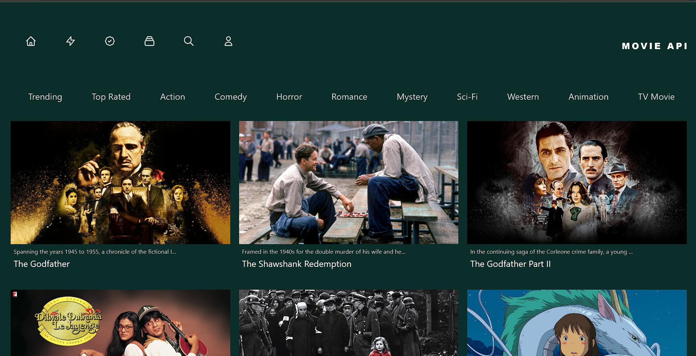

# [Movie API](https://mshabunin97.github.io/Movie-Api/)

A simple web application for viewing information about movies and TV shows. The app uses The Movie Database (TMDB) API to fetch data about various movies and genres.

## Functionality
* View a list of trending movies and TV shows.
* Filter movies by selecting a specific genre.
* Responsive design optimized for various devices.
* Display details for each movie, including title, overview, rating, and poster.

## Technologies Used

## How to Run
1. Make sure you have Node.js installed.
2. Clone the repository to your computer.
3. In the terminal, navigate to the project folder and run npm install to install the dependencies.
4. After the installation is complete, run npm run dev to start the development server.
5. The app will be available at http://localhost:3000 in your browser.

## Notes 
* Please ensure you have an internet connection, as the app relies on API calls to fetch data.
* For proper loading and access to resources, it is recommended to run a VPN while using the application.